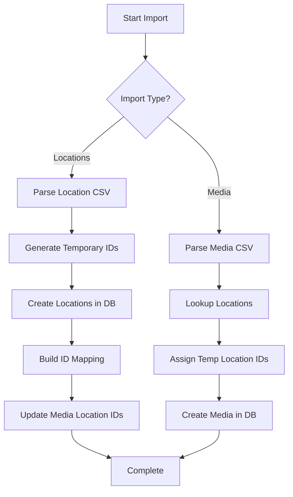

# CSV to Database Mapping

This document describes how CSV data is mapped to database fields for both media and location imports.

## Table of Contents
- [Location Mapping](#location-mapping)
- [Media Mapping](#media-mapping)
- [Access CSV Format](#access-csv-format)
- [Standard CSV Format](#standard-csv-format)

---

## Location Mapping

### Access CSV Format (Box;Ort;Typ)

| CSV Column | CSV Header | Database Field | Required | Notes |
|------------|------------|----------------|----------|-------|
| Column 0 | Box | `box` | ✅ Yes | Physical box/container identifier (e.g., "1", "2", "Box A") |
| Column 1 | Ort | `place` | ❌ No | Physical location/place (e.g., "Regal A", "Shelf 1") |
| Column 2 | Typ | `detail` | ❌ No | Additional detail (e.g., "Oben", "Top shelf") |
| - | - | `id` | Auto | Auto-generated database ID |
| - | - | `created_at` | Auto | Auto-generated timestamp |
| - | - | `updated_at` | Auto | Auto-generated timestamp |

**Example CSV:**
```csv
Box;Ort;Typ
1;Regal A;Oben
2;Regal A;Mitte
3;;
```

**Notes:**
- Only `Box` is required
- Empty `Ort` and `Typ` are allowed
- Internal IDs are generated sequentially during import (1, 2, 3...)
- These temporary IDs are used to map media to locations
- After database insertion, temporary IDs are mapped to actual database IDs

### Standard CSV Format (Box;Place;Detail)

| CSV Column | CSV Header | Database Field | Required | Notes |
|------------|------------|----------------|----------|-------|
| Column 0 | Box | `box` | ✅ Yes | Physical box/container identifier |
| Column 1 | Place | `place` | ❌ No | Physical location/place |
| Column 2 | Detail | `detail` | ❌ No | Additional detail |
| - | - | `id` | Auto | Auto-generated database ID |
| - | - | `created_at` | Auto | Auto-generated timestamp |
| - | - | `updated_at` | Auto | Auto-generated timestamp |

---

## Media Mapping

### Access CSV Format (ID;Name;Firma;Box;Position;Code;Art;Bemerkung;Datum;Verfällt am)

| CSV Column | CSV Header | Database Field | Required | Notes |
|------------|------------|----------------|----------|-------|
| Column 0 | ID | - | ❌ No | External ID from Access (not stored) |
| Column 1 | Name | `name` | ✅ Yes | Media name/title |
| Column 2 | Firma | `company` | ❌ No | Company/publisher name |
| Column 3 | Box | - | ❌ No | Used to lookup location (not stored directly) |
| Column 4 | Position | - | ❌ No | Used to lookup location (not stored directly) |
| Column 5 | Code | `license_code` | ❌ No | License key or activation code |
| Column 6 | Art | `type` | ❌ No | Content category (Archive, Program, Backup, Game, etc.) |
| Column 7 | Bemerkung | `content_description` | ❌ No | Description of contents |
| Column 8 | Datum | `creation_date` | ❌ No | Creation date (DD.MM.YYYY format) |
| Column 9 | Verfällt am | `valid_until_date` | ❌ No | Expiration date (DD.MM.YYYY format) |
| - | - | `media_type` | Default | Defaults to "Unknown" (physical storage medium) |
| - | - | `remarks` | - | Not in Access CSV (set to NULL) |
| - | - | `location_id` | Lookup | Looked up by matching Box + Position |
| - | - | `id` | Auto | Auto-generated database ID |
| - | - | `created_at` | Auto | Auto-generated timestamp |
| - | - | `updated_at` | Auto | Auto-generated timestamp |

**Example CSV:**
```csv
ID;Name;Firma;Box;Position;Code;Art;Bemerkung;Datum;Verfällt am
1;Windows 10 Pro;Microsoft;1;Regal A;XXXXX-XXXXX-XXXXX;Program;Operating System;01.01.2020;01.01.2025
2;Backup Archive 2024;Internal;3;Regal A;;Backup;Full system backup;31.12.2023;31.12.2024
```

**Important Notes:**
- `Art` field (content category) is stored in `type` field, NOT `media_type`
- `media_type` represents physical storage medium (DVD, CD, USB-Stick, etc.) and defaults to "Unknown"
- `type` represents content category (Archive, Program, Backup, Game, etc.)
- Location lookup uses Box + Position to find matching location
- If location not found, `location_id` is set to NULL

### Standard CSV Format (Name;MediaType;Company;LicenseCode;CreationDate;ValidUntilDate;ContentDescription;Remarks;LocationID)

| CSV Column | CSV Header | Database Field | Required | Notes |
|------------|------------|----------------|----------|-------|
| Column 0 | Name | `name` | ✅ Yes | Media name/title |
| Column 1 | Media Type | `media_type` | ❌ No | Physical storage medium (DVD, CD, USB-Stick, etc.) |
| Column 2 | Company | `company` | ❌ No | Company/publisher name |
| Column 3 | License Code | `license_code` | ❌ No | License key or activation code |
| Column 4 | Creation Date | `creation_date` | ❌ No | Creation date (YYYY-MM-DD format) |
| Column 5 | Valid Until Date | `valid_until_date` | ❌ No | Expiration date (YYYY-MM-DD format) |
| Column 6 | Content Description | `content_description` | ❌ No | Description of contents |
| Column 7 | Remarks | `remarks` | ❌ No | Additional notes |
| Column 8 | Location ID | `location_id` | ❌ No | Database ID of storage location |
| - | - | `type` | - | Not in standard CSV (set to NULL) |
| - | - | `id` | Auto | Auto-generated database ID |
| - | - | `created_at` | Auto | Auto-generated timestamp |
| - | - | `updated_at` | Auto | Auto-generated timestamp |

---

## Access CSV Format

### Field Descriptions

#### Location Fields
- **Box**: Physical box/container identifier (e.g., "1", "2", "Box A")
  - This is the ONLY required field
  - Used as the primary reference for location lookup
- **Ort** (Place): Physical location where box is stored (e.g., "Regal A", "Shelf 1")
  - Optional - can be empty
- **Typ** (Detail): Additional detail about location (e.g., "Oben", "Top shelf")
  - Optional - can be empty

#### Media Fields
- **ID**: External ID from Access database
  - Not stored in Media Archive database
  - Used only during import for reference
- **Name**: Media name/title
  - Required field
- **Firma** (Company): Company or publisher name
  - Optional
- **Box**: Physical box identifier for location lookup
  - Used to find matching location
  - Not stored directly in media table
- **Position** (Place): Physical place for location lookup
  - Used to find matching location
  - Not stored directly in media table
- **Code**: License key or activation code
  - Optional
- **Art**: Content category (Archive, Program, Backup, Game, Image, Lexica, Other)
  - Stored in `type` field (NOT `media_type`)
  - Represents what kind of content is on the media
  - Optional
- **Bemerkung** (Remarks): Description of contents
  - Stored in `content_description` field
  - Optional
- **Datum**: Creation date in DD.MM.YYYY format
  - Converted to ISO format (YYYY-MM-DD) for database
  - Time part is ignored if present
  - Optional
- **Verfällt am**: Expiration date in DD.MM.YYYY format
  - Converted to ISO format (YYYY-MM-DD) for database
  - Time part is ignored if present
  - Optional

### Content Type vs Media Type

**Important Distinction:**

- **`type` (Content Type)**: What kind of content is on the media
  - Examples: Archive, Program, Backup, Game, Image, Lexica
  - Comes from Access "Art" field
  - Stored in `Media.type` field
  
- **`media_type` (Storage Medium)**: Physical storage medium
  - Examples: DVD, CD, Blu-ray, USB-Stick, External-HDD, SD-Card
  - NOT in Access CSV - defaults to "Unknown"
  - Stored in `Media.media_type` field

---

## Standard CSV Format

### Field Descriptions

#### Location Fields
- **Box**: Physical box/container identifier
  - Required field
- **Place**: Physical location where box is stored
  - Optional
- **Detail**: Additional detail about location
  - Optional

#### Media Fields
- **Name**: Media name/title
  - Required field
- **Media Type**: Physical storage medium (DVD, CD, USB-Stick, etc.)
  - Optional - defaults to "Unknown"
- **Company**: Company or publisher name
  - Optional
- **License Code**: License key or activation code
  - Optional
- **Creation Date**: Creation date in YYYY-MM-DD format
  - Optional
- **Valid Until Date**: Expiration date in YYYY-MM-DD format
  - Optional
- **Content Description**: Description of contents
  - Optional
- **Remarks**: Additional notes
  - Optional
- **Location ID**: Database ID of storage location
  - Optional
  - Must reference existing location in database

---

## Import Workflow

### Two-Phase Import Strategy

When importing from Access CSV format:

1. **Import Locations First**
   - Parse location CSV with temporary internal IDs (1, 2, 3...)
   - Create locations in database (gets real database IDs)
   - Build mapping: `{temp_id: db_id}` (e.g., `{1: 42, 2: 43, 3: 44}`)

2. **Import Media Second**
   - Parse media CSV
   - Lookup locations by Box + Position
   - Assign temporary location IDs to media
   - Create media in database

3. **Update Media Location IDs**
   - For each media with temporary location ID
   - Update with actual database location ID from mapping
   - Ensures all media have valid location references

### Location Lookup Logic

When importing media from Access CSV:

```
For each media row:
  1. Extract Box and Position from CSV
  2. Search locations for matching Box + Place
  3. If found: Set media.location_id = location.id
  4. If not found: Set media.location_id = NULL (log warning)
```

### Date Conversion

Access CSV dates are in DD.MM.YYYY format:
- Time part is ignored if present (e.g., "01.01.2020 14:30" → "2020-01-01")
- Converted to ISO format (YYYY-MM-DD) for database storage
- Empty dates are stored as NULL

---

## Database Schema

### locations Table
```sql
CREATE TABLE locations (
    id INTEGER PRIMARY KEY AUTOINCREMENT,
    box TEXT NOT NULL,
    place TEXT,
    detail TEXT,
    created_at TEXT NOT NULL,
    updated_at TEXT NOT NULL
)
```

### media Table
```sql
CREATE TABLE media (
    id INTEGER PRIMARY KEY AUTOINCREMENT,
    name TEXT NOT NULL,
    media_type TEXT,
    type TEXT,
    content_description TEXT,
    remarks TEXT,
    creation_date TEXT,
    valid_until_date TEXT,
    company TEXT,
    license_code TEXT,
    location_id INTEGER,
    created_at TEXT NOT NULL,
    updated_at TEXT NOT NULL,
    FOREIGN KEY (location_id) REFERENCES locations(id)
)
```

---

## Examples

### Example 1: Complete Media Import

**Access CSV:**
```csv
ID;Name;Firma;Box;Position;Code;Art;Bemerkung;Datum;Verfällt am
1;Windows 10 Pro;Microsoft;1;Regal A;XXXXX-XXXXX-XXXXX;Program;Operating System;01.01.2020;01.01.2025
```

**Database Record:**
```python
Media(
    id=1,                                    # Auto-generated
    name="Windows 10 Pro",                   # From Name
    media_type="Unknown",                    # Default (not in CSV)
    type="Program",                          # From Art
    company="Microsoft",                     # From Firma
    license_code="XXXXX-XXXXX-XXXXX",       # From Code
    creation_date=date(2020, 1, 1),         # From Datum (converted)
    valid_until_date=date(2025, 1, 1),      # From Verfällt am (converted)
    content_description="Operating System",  # From Bemerkung
    remarks=None,                            # Not in Access CSV
    location_id=42,                          # Looked up by Box="1" + Position="Regal A"
    created_at="2024-03-08T21:30:00",       # Auto-generated
    updated_at="2024-03-08T21:30:00"        # Auto-generated
)
```

### Example 2: Minimal Location Import

**Access CSV:**
```csv
Box;Ort;Typ
1;;
2;Regal A;
3;Regal B;Oben
```

**Database Records:**
```python
# Row 1: Only Box provided
StorageLocation(
    id=1,                                    # Auto-generated
    box="1",                                 # From Box
    place="",                                # Empty (allowed)
    detail=None,                             # Empty (allowed)
    created_at="2024-03-08T21:30:00",       # Auto-generated
    updated_at="2024-03-08T21:30:00"        # Auto-generated
)

# Row 2: Box and Ort provided
StorageLocation(
    id=2,
    box="2",
    place="Regal A",
    detail=None,
    created_at="2024-03-08T21:30:00",
    updated_at="2024-03-08T21:30:00"
)

# Row 3: All fields provided
StorageLocation(
    id=3,
    box="3",
    place="Regal B",
    detail="Oben",
    created_at="2024-03-08T21:30:00",
    updated_at="2024-03-08T21:30:00"
)
```

### Example 3: Media Without Location

**Access CSV:**
```csv
ID;Name;Firma;Box;Position;Code;Art;Bemerkung;Datum;Verfällt am
1;Test Media;Company;99;Unknown Location;;Program;Description;01.01.2020;
```

**Database Record:**
```python
Media(
    id=1,
    name="Test Media",
    media_type="Unknown",
    type="Program",
    company="Company",
    license_code=None,
    creation_date=date(2020, 1, 1),
    valid_until_date=None,
    content_description="Description",
    remarks=None,
    location_id=None,                        # Location not found (Box=99, Position=Unknown Location)
    created_at="2024-03-08T21:30:00",
    updated_at="2024-03-08T21:30:00"
)
```

---

## Standard CSV Format

### Location CSV

**Format:** `Box,Place,Detail`

**Example:**
```csv
Box,Place,Detail
CD Register A,Office Cabinet,Shelf 1
DVD Box 1,Living Room,Top Shelf
```

### Media CSV

**Format:** `Name,MediaType,Company,LicenseCode,CreationDate,ValidUntilDate,ContentDescription,Remarks,LocationID`

**Example:**
```csv
Name,Media Type,Company,License Code,Creation Date,Valid Until Date,Content Description,Remarks,Location ID
Windows 10 Pro,DVD,Microsoft,XXXXX-XXXXX-XXXXX,2020-01-01,2025-01-01,Operating System,Backup copy,1
Linux Mint 21,USB-Stick,Linux Foundation,,,Linux Distribution,Bootable USB,2
```

**Notes:**
- Dates are in ISO format (YYYY-MM-DD)
- Location ID must reference existing location in database
- Empty fields are allowed (except Name)

---

## Validation Rules

### Location Validation
- **Box**: Required, cannot be empty
- **Place**: Optional, can be empty string
- **Detail**: Optional, can be NULL

### Media Validation
- **Name**: Required, cannot be empty
- **Media Type**: Optional, defaults to "Unknown"
- **Type**: Optional, can be NULL
- **Dates**: Must be valid dates if provided
- **Location ID**: Must reference existing location if provided (or NULL)

---

## Import Process Flow



### Detailed Steps

1. **Location Import**
   - Read CSV file
   - Parse rows with temporary IDs (1, 2, 3...)
   - Create locations in database (gets real IDs: 42, 43, 44...)
   - Build mapping: `{1: 42, 2: 43, 3: 44}`
   - Update any existing media with temporary IDs to use real IDs

2. **Media Import**
   - Read CSV file
   - For each row:
     - Extract Box and Position
     - Search locations for match
     - If found: Use location's database ID
     - If not found: Set location_id to NULL
   - Create media in database

---

## Error Handling

### Location Import Errors
- **Missing Box**: Row skipped, error logged
- **Duplicate Box+Place**: Allowed (creates separate records)
- **Invalid characters**: Preserved as-is

### Media Import Errors
- **Missing Name**: Row skipped, error logged
- **Invalid Date Format**: Row skipped, error logged
- **Location Not Found**: Media created with NULL location_id, warning logged
- **Invalid Media Type**: Defaults to "Unknown"

---

## Content Type Categories

The `type` field (from Access "Art" field) represents content categories:

| Access Art Value | Media.type Value | Description |
|------------------|------------------|-------------|
| Archive | Archive | Archive/backup content |
| Image | Image | Image/photo content |
| Lexica | Lexica | Reference/lexicon content |
| Program | Program | Software/program content |
| Backup | Backup | Backup content |
| Game | Game | Game content |
| Other | Other | Other content |
| (empty) | NULL | No content type specified |

**Note:** These are content categories, NOT storage media types (DVD, CD, etc.)

---

## Physical Media Types

The `media_type` field represents physical storage medium:

| Media Type | Description |
|------------|-------------|
| DVD | DVD disc |
| Blu-ray | Blu-ray disc |
| CD | CD disc |
| USB-Stick | USB flash drive |
| External-HDD | External hard drive |
| SD-Card | SD memory card |
| Other | Other storage medium |
| Unknown | Unknown/unspecified (default for Access imports) |

---

## Implementation Files

- **Mapper**: [`src/business/access_csv_mapper.py`](../src/business/access_csv_mapper.py)
- **Import Dialog**: [`src/gui/import_dialog.py`](../src/gui/import_dialog.py)
- **Main Window**: [`src/gui/main_window.py`](../src/gui/main_window.py)
- **Models**: 
  - [`src/models/media.py`](../src/models/media.py)
  - [`src/models/location.py`](../src/models/location.py)
- **Tests**:
  - [`tests/test_phase6a_access_mapper.py`](../tests/test_phase6a_access_mapper.py)
  - [`tests/test_phase6_real_csv_import.py`](../tests/test_phase6_real_csv_import.py)
