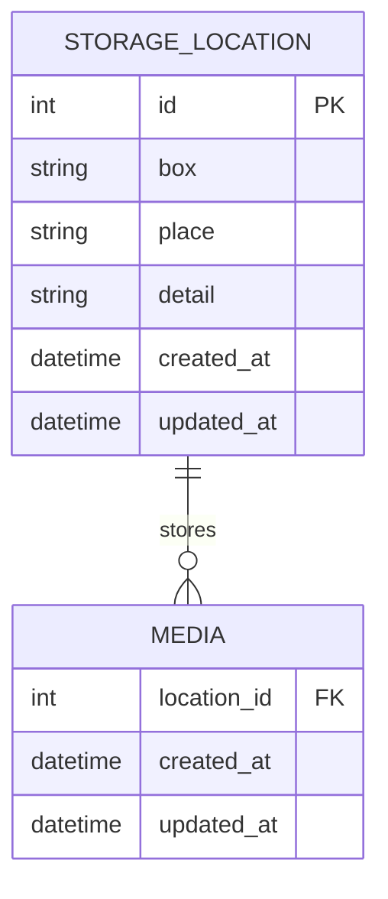

# Data Model

## Overview

The Media Archive Manager uses a normalized SQLite database with two main tables: `media` and `storage_location`. The schema is designed for simplicity, data integrity, and efficient querying.

## Database Schema

### Entity Relationship Diagram



## Table Definitions

### storage_location

Stores physical storage locations where media is kept.

| Column | Type | Constraints | Description |
|--------|------|-------------|-------------|
| id | INTEGER | PRIMARY KEY, AUTOINCREMENT | Unique identifier |
| box | TEXT | NOT NULL | Container name (e.g., "CD Register A") |
| place | TEXT | NOT NULL | Physical location (e.g., "office cabinet") |
| detail | TEXT | NULL | Additional detail (e.g., "slot 4") |
| created_at | TIMESTAMP | NOT NULL, DEFAULT CURRENT_TIMESTAMP | Record creation time |
| updated_at | TIMESTAMP | NOT NULL, DEFAULT CURRENT_TIMESTAMP | Last update time |

**Indexes:**
- `idx_storage_location_box` on `box` for quick lookup
- `idx_storage_location_place` on `place` for filtering

**Example Records:**
```sql
INSERT INTO storage_location (box, place, detail) VALUES
  ('CD Register A', 'office cabinet', 'slot 4'),
  ('DVD Box 1', 'basement shelf', 'top row'),
  ('M-Disk Archive', 'fireproof safe', NULL);
```

### media

Stores information about individual media items.

| Column | Type | Constraints | Description |
|--------|------|-------------|-------------|
| id | INTEGER | PRIMARY KEY, AUTOINCREMENT | Unique identifier |
| name | TEXT | NOT NULL | Media name/title |
| content_description | TEXT | NULL | Description of contents |
| remarks | TEXT | NULL | Additional notes |
| creation_date | DATE | NULL | When media was created |
| valid_until_date | DATE | NULL | Expiration date (if applicable) |
| media_type | TEXT | NOT NULL | Type of media (see MediaType enum) |
| company | TEXT | NULL | Company/publisher name |
| license_code | TEXT | NULL | License key or activation code |
| location_id | INTEGER | FOREIGN KEY, NULL | Reference to storage_location |
| created_at | TIMESTAMP | NOT NULL, DEFAULT CURRENT_TIMESTAMP | Record creation time |
| updated_at | TIMESTAMP | NOT NULL, DEFAULT CURRENT_TIMESTAMP | Last update time |

**Foreign Keys:**
- `location_id` REFERENCES `storage_location(id)` ON DELETE SET NULL

**Indexes:**
- `idx_media_name` on `name` for search
- `idx_media_type` on `media_type` for filtering
- `idx_media_location` on `location_id` for location queries
- `idx_media_valid_until` on `valid_until_date` for expiration queries
- `idx_media_creation_date` on `creation_date` for date searches

**Full-Text Search:**
- Consider adding FTS5 virtual table for content_description search (future enhancement)

**Example Records:**
```sql
INSERT INTO media (name, content_description, media_type, company, location_id) VALUES
  ('Windows 11 Pro', 'Installation media for Windows 11 Professional', 'DVD', 'Microsoft', 1),
  ('Family Photos 2020', 'Backup of family photos from 2020', 'M-Disk', NULL, 3),
  ('Adobe CS6', 'Adobe Creative Suite 6 Master Collection', 'DVD', 'Adobe', 1);
```

## Enumerations

### MediaType

Predefined media types (stored as TEXT in database):

| Value | Description |
|-------|-------------|
| `M-Disk` | M-Disk optical media (archival quality) |
| `DVD` | DVD disc |
| `CD` | CD disc |
| `Blu-ray` | Blu-ray disc |
| `USB Drive` | USB flash drive |
| `External HDD` | External hard drive |
| `Backup Tape` | Backup tape media |
| `Other` | Other media type |

**Implementation Note:** Store as TEXT for flexibility. Validate in application layer.

## Database Schema SQL

### Complete Schema Definition

```sql
-- Storage Location Table
CREATE TABLE storage_location (
    id INTEGER PRIMARY KEY AUTOINCREMENT,
    box TEXT NOT NULL,
    place TEXT NOT NULL,
    detail TEXT,
    created_at TIMESTAMP NOT NULL DEFAULT CURRENT_TIMESTAMP,
    updated_at TIMESTAMP NOT NULL DEFAULT CURRENT_TIMESTAMP
);

-- Storage Location Indexes
CREATE INDEX idx_storage_location_box ON storage_location(box);
CREATE INDEX idx_storage_location_place ON storage_location(place);

-- Media Table
CREATE TABLE media (
    id INTEGER PRIMARY KEY AUTOINCREMENT,
    name TEXT NOT NULL,
    content_description TEXT,
    remarks TEXT,
    creation_date DATE,
    valid_until_date DATE,
    media_type TEXT NOT NULL,
    company TEXT,
    license_code TEXT,
    location_id INTEGER,
    created_at TIMESTAMP NOT NULL DEFAULT CURRENT_TIMESTAMP,
    updated_at TIMESTAMP NOT NULL DEFAULT CURRENT_TIMESTAMP,
    FOREIGN KEY (location_id) REFERENCES storage_location(id) ON DELETE SET NULL
);

-- Media Indexes
CREATE INDEX idx_media_name ON media(name);
CREATE INDEX idx_media_type ON media(media_type);
CREATE INDEX idx_media_location ON media(location_id);
CREATE INDEX idx_media_valid_until ON media(valid_until_date);
CREATE INDEX idx_media_creation_date ON media(creation_date);

-- Trigger to update updated_at timestamp for storage_location
CREATE TRIGGER update_storage_location_timestamp 
AFTER UPDATE ON storage_location
FOR EACH ROW
BEGIN
    UPDATE storage_location SET updated_at = CURRENT_TIMESTAMP WHERE id = OLD.id;
END;

-- Trigger to update updated_at timestamp for media
CREATE TRIGGER update_media_timestamp 
AFTER UPDATE ON media
FOR EACH ROW
BEGIN
    UPDATE media SET updated_at = CURRENT_TIMESTAMP WHERE id = OLD.id;
END;
```

## Data Validation Rules

### storage_location

| Field | Validation Rules |
|-------|-----------------|
| box | Required, max 100 characters, trim whitespace |
| place | Required, max 100 characters, trim whitespace |
| detail | Optional, max 200 characters, trim whitespace |

### media

| Field | Validation Rules |
|-------|-----------------|
| name | Required, max 200 characters, trim whitespace |
| content_description | Optional, max 2000 characters |
| remarks | Optional, max 2000 characters |
| creation_date | Optional, valid date, not in future |
| valid_until_date | Optional, valid date, must be >= creation_date |
| media_type | Required, must be valid MediaType value |
| company | Optional, max 100 characters, trim whitespace |
| license_code | Optional, max 200 characters |
| location_id | Optional, must reference existing storage_location |

## Common Queries

### Search Media by Name
```sql
SELECT m.*, sl.box, sl.place, sl.detail
FROM media m
LEFT JOIN storage_location sl ON m.location_id = sl.id
WHERE m.name LIKE '%search_term%'
ORDER BY m.name;
```

### Search Media by Content
```sql
SELECT m.*, sl.box, sl.place, sl.detail
FROM media m
LEFT JOIN storage_location sl ON m.location_id = sl.id
WHERE m.content_description LIKE '%search_term%'
ORDER BY m.name;
```

### List Expired Media
```sql
SELECT m.*, sl.box, sl.place, sl.detail
FROM media m
LEFT JOIN storage_location sl ON m.location_id = sl.id
WHERE m.valid_until_date IS NOT NULL 
  AND m.valid_until_date < DATE('now')
ORDER BY m.valid_until_date;
```

### List Media by Location
```sql
SELECT m.*, sl.box, sl.place, sl.detail
FROM media m
INNER JOIN storage_location sl ON m.location_id = sl.id
WHERE sl.id = ?
ORDER BY m.name;
```

### Filter by Media Type
```sql
SELECT m.*, sl.box, sl.place, sl.detail
FROM media m
LEFT JOIN storage_location sl ON m.location_id = sl.id
WHERE m.media_type = ?
ORDER BY m.name;
```

### Search by Creation Date Range
```sql
SELECT m.*, sl.box, sl.place, sl.detail
FROM media m
LEFT JOIN storage_location sl ON m.location_id = sl.id
WHERE m.creation_date BETWEEN ? AND ?
ORDER BY m.creation_date DESC;
```

### Get Media Count by Type
```sql
SELECT media_type, COUNT(*) as count
FROM media
GROUP BY media_type
ORDER BY count DESC;
```

### Get Media Count by Location
```sql
SELECT sl.box, sl.place, COUNT(m.id) as count
FROM storage_location sl
LEFT JOIN media m ON sl.id = m.location_id
GROUP BY sl.id, sl.box, sl.place
ORDER BY count DESC;
```

## Data Migration

### CSV Import Format

**storage_location.csv:**
```csv
box,place,detail
"CD Register A","office cabinet","slot 4"
"DVD Box 1","basement shelf","top row"
```

**media.csv:**
```csv
name,content_description,remarks,creation_date,valid_until_date,media_type,company,license_code,location_box,location_place
"Windows 11 Pro","Installation media","Keep safe","2023-01-15",,"DVD","Microsoft","XXXXX-XXXXX","CD Register A","office cabinet"
```

**Import Process:**
1. Import storage_location.csv first
2. Create location_id mapping (box + place → id)
3. Import media.csv, resolving location references
4. Validate all data
5. Report any errors

### CSV Export Format

Export includes all fields with proper escaping and UTF-8 encoding.

## Database Maintenance

### Backup Strategy
1. **Simple Backup**: Copy `media_archive.db` file
2. **Scheduled Backup**: Copy to backup folder with timestamp
3. **Export Backup**: Export to CSV for portability

### Integrity Checks
```sql
-- Check for orphaned media (invalid location_id)
SELECT m.id, m.name, m.location_id
FROM media m
WHERE m.location_id IS NOT NULL
  AND NOT EXISTS (SELECT 1 FROM storage_location WHERE id = m.location_id);

-- Check for invalid media types
SELECT DISTINCT media_type
FROM media
WHERE media_type NOT IN ('M-Disk', 'DVD', 'CD', 'Blu-ray', 'USB Drive', 'External HDD', 'Backup Tape', 'Other');

-- Check for invalid dates
SELECT id, name, creation_date, valid_until_date
FROM media
WHERE valid_until_date IS NOT NULL
  AND creation_date IS NOT NULL
  AND valid_until_date < creation_date;
```

### Vacuum and Optimize
```sql
-- Reclaim unused space and optimize
VACUUM;

-- Update statistics for query optimizer
ANALYZE;
```

## Future Enhancements

### Potential Schema Extensions

1. **Tags Table**: Many-to-many relationship for flexible categorization
2. **Media History**: Track changes to media records
3. **Attachments**: Store file paths to related documents/images
4. **Custom Fields**: User-defined metadata fields
5. **Full-Text Search**: FTS5 virtual table for advanced search

### Example Tags Extension
```sql
CREATE TABLE tag (
    id INTEGER PRIMARY KEY AUTOINCREMENT,
    name TEXT NOT NULL UNIQUE
);

CREATE TABLE media_tag (
    media_id INTEGER NOT NULL,
    tag_id INTEGER NOT NULL,
    PRIMARY KEY (media_id, tag_id),
    FOREIGN KEY (media_id) REFERENCES media(id) ON DELETE CASCADE,
    FOREIGN KEY (tag_id) REFERENCES tag(id) ON DELETE CASCADE
);
```

## References

- [PROJECT_OVERVIEW.md](PROJECT_OVERVIEW.md) - Application overview
- [UI_WORKFLOW.md](UI_WORKFLOW.md) - How data is displayed and edited
- [DEV_RULES.md](DEV_RULES.md) - Implementation guidelines
