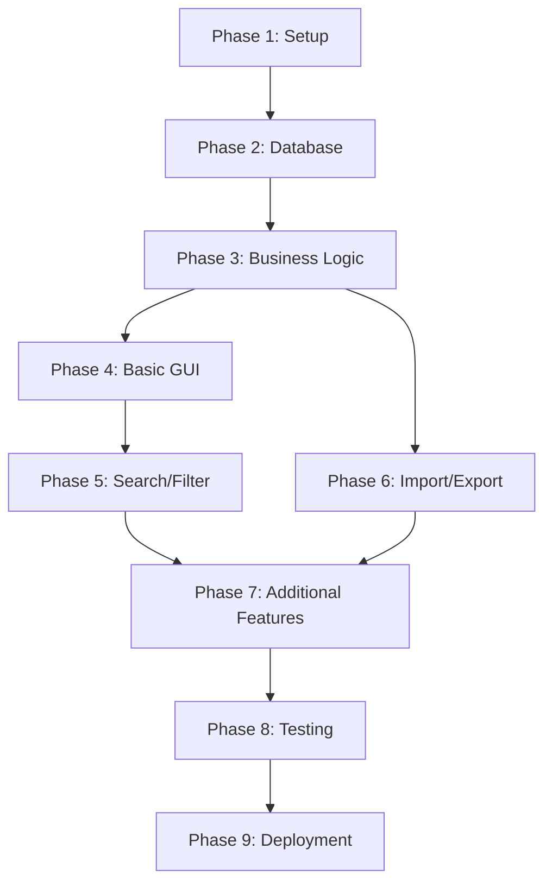

# Implementation Tasks

## Overview

This document provides a detailed implementation roadmap for the Media Archive Manager application. Tasks are organized into phases, with each phase building upon the previous one.

## Implementation Phases

### Phase 1: Project Setup and Foundation

**Goal**: Set up the project structure and foundational components.

#### Tasks

1. **Create Project Structure**
   - Create all directories (src/, tests/, data/, docs/)
   - Create `__init__.py` files in all packages
   - Create `.gitignore` file
   - Create `requirements.txt` file
   - Initialize git repository

2. **Create Configuration Module**
   - Create `src/utils/config.py`
   - Define application paths
   - Define database settings
   - Define validation limits
   - Define UI settings

3. **Create Data Models**
   - Create `src/models/enums.py` with MediaType enum
   - Create `src/models/location.py` with StorageLocation class
   - Create `src/models/media.py` with Media class
   - Add type hints and docstrings

4. **Create Custom Exceptions**
   - Create `src/utils/exceptions.py`
   - Define MediaArchiveError base exception
   - Define ValidationError
   - Define DatabaseError
   - Define NotFoundError

**Deliverables:**
- Complete project structure
- Configuration module
- Data models with type hints
- Custom exception hierarchy

---

### Phase 2: Database Layer

**Goal**: Implement database schema and data access layer.

#### Tasks

1. **Create Database Schema**
   - Create `src/data/schema.py`
   - Define storage_location table SQL
   - Define media table SQL
   - Define indexes
   - Define triggers for updated_at timestamps

2. **Create Database Manager**
   - Create `src/data/database.py`
   - Implement Database class with connection management
   - Implement context manager protocol
   - Implement schema initialization
   - Add error handling and logging

3. **Create Storage Location Repository**
   - Create `src/data/location_repository.py`
   - Implement create() method
   - Implement find_by_id() method
   - Implement find_all() method
   - Implement update() method
   - Implement delete() method
   - Implement find_by_box_and_place() method
   - Add parameterized queries

4. **Create Media Repository**
   - Create `src/data/media_repository.py`
   - Implement create() method
   - Implement find_by_id() method
   - Implement find_all() method
   - Implement update() method
   - Implement delete() method
   - Implement search_by_name() method
   - Implement search_by_content() method
   - Implement find_by_type() method
   - Implement find_by_location() method
   - Implement find_expired() method
   - Implement find_by_date_range() method
   - Add parameterized queries

5. **Test Database Layer**
   - Create `tests/test_database.py`
   - Create `tests/test_location_repository.py`
   - Create `tests/test_media_repository.py`
   - Test CRUD operations
   - Test search functionality
   - Test error handling
   - Use in-memory database for tests

**Deliverables:**
- Database schema with tables and indexes
- Database connection manager
- Repository classes for data access
- Comprehensive unit tests

---

### Phase 3: Business Logic Layer

**Goal**: Implement business logic, validation, and services.

#### Tasks

1. **Create Validation Module**
   - Create `src/business/validation.py`
   - Implement MediaValidator class
   - Implement validate_name() method
   - Implement validate_media_type() method
   - Implement validate_dates() method
   - Implement LocationValidator class
   - Implement validate_box() method
   - Implement validate_place() method
   - Add comprehensive validation rules

2. **Create Storage Location Service**
   - Create `src/business/location_service.py`
   - Implement LocationService class
   - Implement create_location() method with validation
   - Implement update_location() method with validation
   - Implement delete_location() method
   - Implement get_all_locations() method
   - Implement get_location_by_id() method
   - Add error handling

3. **Create Media Service**
   - Create `src/business/media_service.py`
   - Implement MediaService class
   - Implement create_media() method with validation
   - Implement update_media() method with validation
   - Implement delete_media() method
   - Implement get_all_media() method
   - Implement get_media_by_id() method
   - Add business logic and error handling

4. **Create Search Service**
   - Create `src/business/search_service.py`
   - Implement SearchService class
   - Implement search_by_name() method
   - Implement search_by_content() method
   - Implement search_by_both() method
   - Implement filter_by_type() method
   - Implement filter_by_location() method
   - Implement filter_by_date_range() method
   - Implement get_expired_media() method
   - Add search result sorting

5. **Create Export Service**
   - Create `src/business/export_service.py`
   - Implement ExportService class
   - Implement export_media_to_csv() method
   - Implement export_locations_to_csv() method
   - Implement import_media_from_csv() method
   - Implement import_locations_from_csv() method
   - Add validation and error reporting
   - Handle CSV encoding (UTF-8)

6. **Create Utility Functions**
   - Create `src/utils/date_utils.py`
   - Implement format_date() function
   - Implement parse_date() function
   - Implement validate_date() function
   - Implement is_expired() function

7. **Test Business Logic Layer**
   - Create `tests/test_validation.py`
   - Create `tests/test_location_service.py`
   - Create `tests/test_media_service.py`
   - Create `tests/test_search_service.py`
   - Create `tests/test_export_service.py`
   - Test validation rules
   - Test service methods
   - Test error handling
   - Mock repository dependencies

**Deliverables:**
- Validation module with comprehensive rules
- Service classes for business logic
- Export/import functionality
- Utility functions
- Comprehensive unit tests

---

### Phase 4: GUI Layer - Basic Components

**Goal**: Create basic GUI components and main window.

#### Tasks

1. **Create Custom Widgets**
   - Create `src/gui/widgets/__init__.py`
   - Create `src/gui/widgets/media_table.py`
   - Implement MediaTable widget (Treeview)
   - Add column sorting
   - Add row selection
   - Add context menu
   - Add expired media highlighting

2. **Create Main Window**
   - Create `src/gui/main_window.py`
   - Implement MainWindow class
   - Create menu bar (File, Edit, View, Tools, Help)
   - Create toolbar with buttons
   - Add MediaTable widget
   - Create status bar
   - Add window icon and title
   - Set window size and position

3. **Create Media Form Dialog**
   - Create `src/gui/media_form.py`
   - Implement MediaFormDialog class
   - Create form fields (name, type, company, etc.)
   - Add date picker widgets
   - Add location dropdown
   - Add validation feedback
   - Implement Save and Cancel buttons
   - Add "Save & New" button

4. **Create Location Management Dialog**
   - Create `src/gui/location_dialog.py`
   - Implement LocationDialog class
   - Create location list table
   - Add Add/Edit/Delete buttons
   - Create location form (box, place, detail)
   - Add validation feedback
   - Show media count per location

5. **Wire Up Basic Functionality**
   - Connect Add button to MediaFormDialog
   - Connect Edit button to MediaFormDialog
   - Connect Delete button to confirmation dialog
   - Connect Manage Locations to LocationDialog
   - Implement data loading in MainWindow
   - Implement table refresh after changes

6. **Add Error Handling**
   - Create error message dialogs
   - Create success message dialogs
   - Create confirmation dialogs
   - Add try-catch blocks in GUI layer
   - Display user-friendly error messages

**Deliverables:**
- Main application window with menu and toolbar
- Media table widget with sorting
- Add/Edit media dialog
- Location management dialog
- Basic CRUD functionality working

---

### Phase 5: GUI Layer - Search and Filter

**Goal**: Implement search and filter functionality.

#### Tasks

1. **Create Search Panel**
   - Create `src/gui/search_panel.py`
   - Implement SearchPanel class
   - Add search text field
   - Add search scope radio buttons (name/content/both)
   - Add media type dropdown filter
   - Add date range pickers
   - Add location dropdown filter
   - Add "Show only expired" checkbox
   - Add Search and Clear buttons

2. **Integrate Search Panel**
   - Add SearchPanel to MainWindow
   - Make panel collapsible
   - Connect Search button to search functionality
   - Connect Clear button to reset filters
   - Update table when search executed
   - Show filtered count in status bar

3. **Implement Filter Menu**
   - Add "Filter by Type" submenu
   - Add menu items for each media type
   - Connect menu items to filter functionality
   - Update table when filter applied
   - Show active filter in status bar

4. **Implement Expired Media View**
   - Add "Show Expired Media" menu item
   - Filter table to show only expired media
   - Highlight expired rows in red
   - Add "Show All Media" menu item to clear filter

5. **Add Keyboard Shortcuts**
   - Implement Ctrl+N for new media
   - Implement Ctrl+E for edit
   - Implement Delete key for delete
   - Implement Ctrl+F for search panel toggle
   - Implement F5 for refresh
   - Implement Ctrl+L for manage locations
   - Implement Enter to edit selected row
   - Implement Escape to close dialogs

**Deliverables:**
- Search panel with multiple criteria
- Filter functionality by type and location
- Expired media view
- Keyboard shortcuts
- Responsive UI updates

---

### Phase 6: Import/Export Functionality

**Goal**: Implement CSV import and export features.

#### Tasks

1. **Create Import Dialog**
   - Create `src/gui/import_dialog.py`
   - Implement ImportDialog class
   - Add file browser
   - Add import type selection (media/locations)
   - Add options (skip header, validate, update existing)
   - Add preview table
   - Add Import button
   - Show import progress

2. **Create Export Dialog**
   - Create `src/gui/export_dialog.py`
   - Implement ExportDialog class
   - Add export scope selection (all/filtered/selected)
   - Add file browser for save location
   - Add options (include headers, include location details)
   - Add Export button
   - Show export progress

3. **Implement Import Functionality**
   - Connect File → Import menu item
   - Open ImportDialog
   - Call ExportService.import_from_csv()
   - Show import results (success/errors)
   - Refresh table after import
   - Handle import errors gracefully

4. **Implement Export Functionality**
   - Connect File → Export menu item
   - Open ExportDialog
   - Call ExportService.export_to_csv()
   - Show export success message
   - Handle export errors gracefully

5. **Add Database Backup**
   - Add File → Backup Database menu item
   - Open file browser for backup location
   - Copy database file to backup location
   - Add timestamp to backup filename
   - Show backup success message

**Deliverables:**
- CSV import functionality with validation
- CSV export functionality with options
- Database backup feature
- Error handling and user feedback

---

### Phase 7: Additional Features

**Goal**: Add statistics, help, and polish.

#### Tasks

1. **Create Statistics Dialog**
   - Create `src/gui/statistics_dialog.py`
   - Implement StatisticsDialog class
   - Show total media count
   - Show total locations count
   - Show expired media count
   - Show media count by type
   - Show media count by location
   - Add Close button

2. **Add Help Menu Items**
   - Create `src/gui/about_dialog.py`
   - Implement AboutDialog class
   - Show application name and version
   - Show description
   - Show technology stack
   - Add user guide (simple text or link to docs)

3. **Add Application Icon**
   - Create or find suitable icon
   - Add icon to window
   - Add icon to executable (when packaging)

4. **Improve UI Polish**
   - Add tooltips to toolbar buttons
   - Improve spacing and alignment
   - Add alternating row colors in tables
   - Improve color scheme
   - Add focus indicators
   - Test tab order

5. **Add Logging**
   - Configure logging in main.py
   - Add log file output
   - Add console output
   - Log important operations
   - Log errors with stack traces

**Deliverables:**
- Statistics dialog
- About dialog
- Application icon
- Polished UI
- Logging system

---

### Phase 8: Testing and Refinement

**Goal**: Comprehensive testing and bug fixes.

#### Tasks

1. **Integration Testing**
   - Test complete workflows (add → edit → delete)
   - Test search and filter combinations
   - Test import/export with real data
   - Test error scenarios
   - Test with large datasets
   - Test on Windows 10 and 11

2. **User Acceptance Testing**
   - Test with non-technical users
   - Gather feedback on usability
   - Identify confusing UI elements
   - Test with real-world data
   - Verify all requirements met

3. **Bug Fixes**
   - Fix identified bugs
   - Improve error messages
   - Handle edge cases
   - Improve performance if needed

4. **Documentation Updates**
   - Update README with final instructions
   - Create user guide
   - Document known issues
   - Document future enhancements

5. **Code Cleanup**
   - Remove debug code
   - Remove commented code
   - Improve code comments
   - Run code formatter (black)
   - Run type checker (mypy)
   - Fix linting issues

**Deliverables:**
- Fully tested application
- Bug fixes
- Updated documentation
- Clean, production-ready code

---

### Phase 9: Deployment Preparation

**Goal**: Prepare application for distribution.

#### Tasks

1. **Create Entry Point**
   - Create `main.py` in project root
   - Initialize logging
   - Initialize database
   - Create main window
   - Start GUI event loop
   - Add error handling for startup

2. **Create Startup Script**
   - Create `run.bat` for Windows
   - Check Python installation
   - Create virtual environment if needed
   - Install dependencies
   - Run application

3. **Create Installation Guide**
   - Document Python installation
   - Document dependency installation
   - Document first-time setup
   - Document database initialization
   - Document backup procedures

4. **Package Application (Optional)**
   - Use PyInstaller to create executable
   - Test executable on clean Windows system
   - Create installer (optional)
   - Test installer

5. **Create Migration Guide**
   - Document how to export from Access
   - Document CSV format requirements
   - Document import process
   - Provide example CSV files

**Deliverables:**
- Runnable application
- Startup scripts
- Installation guide
- Migration guide
- Optional: Standalone executable

---

## Task Dependencies

## Priority Levels

### Must Have (MVP)
- Phase 1: Project Setup
- Phase 2: Database Layer
- Phase 3: Business Logic Layer
- Phase 4: Basic GUI Components
- Phase 8: Testing (basic)
- Phase 9: Deployment (basic)

### Should Have
- Phase 5: Search and Filter
- Phase 6: Import/Export
- Phase 8: Testing (comprehensive)

### Nice to Have
- Phase 7: Additional Features
- Phase 9: Deployment (packaging)

## Implementation Guidelines

### Development Approach

1. **Test-Driven Development**: Write tests before implementation where possible
2. **Incremental Development**: Complete one phase before moving to next
3. **Continuous Testing**: Test after each task completion
4. **Code Review**: Review code before committing
5. **Documentation**: Update docs as you implement

### Quality Checkpoints

After each phase:
- [ ] All tests passing
- [ ] Code follows style guide
- [ ] Documentation updated
- [ ] No known bugs
- [ ] Performance acceptable

### Risk Management

**Potential Risks:**
1. **Database corruption**: Mitigate with regular backups and transactions
2. **Data loss during import**: Mitigate with validation and preview
3. **Performance with large datasets**: Mitigate with indexes and pagination
4. **UI responsiveness**: Mitigate with async operations
5. **Windows compatibility**: Test on multiple Windows versions

## Progress Tracking

Use this checklist to track overall progress:

### Phase 1: Project Setup ⬜
- [ ] Project structure created
- [ ] Configuration module
- [ ] Data models
- [ ] Custom exceptions

### Phase 2: Database Layer ⬜
- [ ] Database schema
- [ ] Database manager
- [ ] Location repository
- [ ] Media repository
- [ ] Database tests

### Phase 3: Business Logic Layer ⬜
- [ ] Validation module
- [ ] Location service
- [ ] Media service
- [ ] Search service
- [ ] Export service
- [ ] Business logic tests

### Phase 4: Basic GUI ⬜
- [ ] Custom widgets
- [ ] Main window
- [ ] Media form dialog
- [ ] Location dialog
- [ ] Basic CRUD working

### Phase 5: Search/Filter ⬜
- [ ] Search panel
- [ ] Filter functionality
- [ ] Expired media view
- [ ] Keyboard shortcuts

### Phase 6: Import/Export ⬜
- [ ] Import dialog
- [ ] Export dialog
- [ ] Import functionality
- [ ] Export functionality
- [ ] Database backup

### Phase 7: Additional Features ⬜
- [ ] Statistics dialog
- [ ] Help/About dialog
- [ ] Application icon
- [ ] UI polish
- [ ] Logging

### Phase 8: Testing ⬜
- [ ] Integration testing
- [ ] User acceptance testing
- [ ] Bug fixes
- [ ] Documentation updates
- [ ] Code cleanup

### Phase 9: Deployment ⬜
- [ ] Entry point
- [ ] Startup script
- [ ] Installation guide
- [ ] Migration guide
- [ ] Optional: Packaging

## Next Steps

To begin implementation:

1. **Switch to Code mode** to start creating files
2. **Start with Phase 1** (Project Setup)
3. **Follow the task order** within each phase
4. **Test incrementally** as you build
5. **Update this document** as you progress

## References

- [PROJECT_OVERVIEW.md](PROJECT_OVERVIEW.md) - Application overview
- [DATA_MODEL.md](DATA_MODEL.md) - Database schema
- [UI_WORKFLOW.md](UI_WORKFLOW.md) - User interface design
- [DEV_RULES.md](DEV_RULES.md) - Development guidelines
- [PROJECT_STRUCTURE.md](PROJECT_STRUCTURE.md) - File organization
