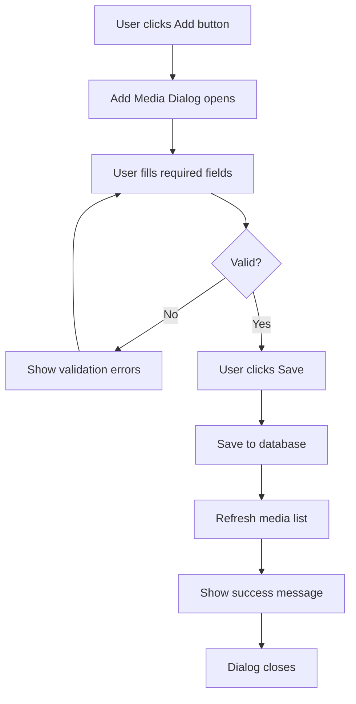
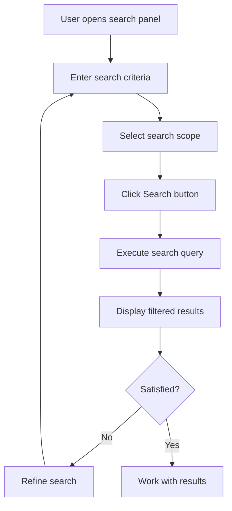
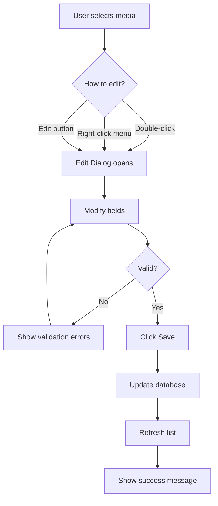
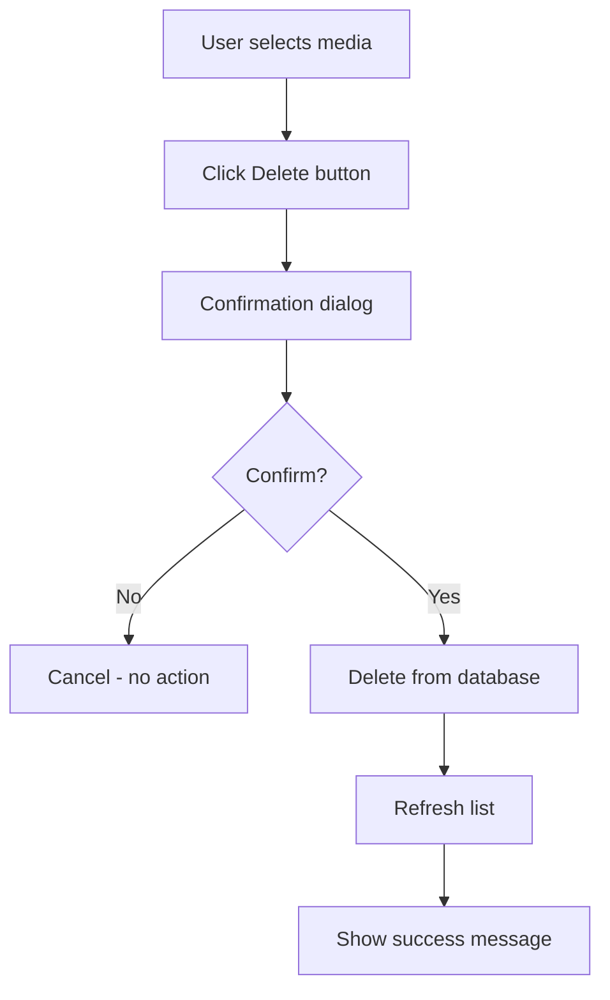
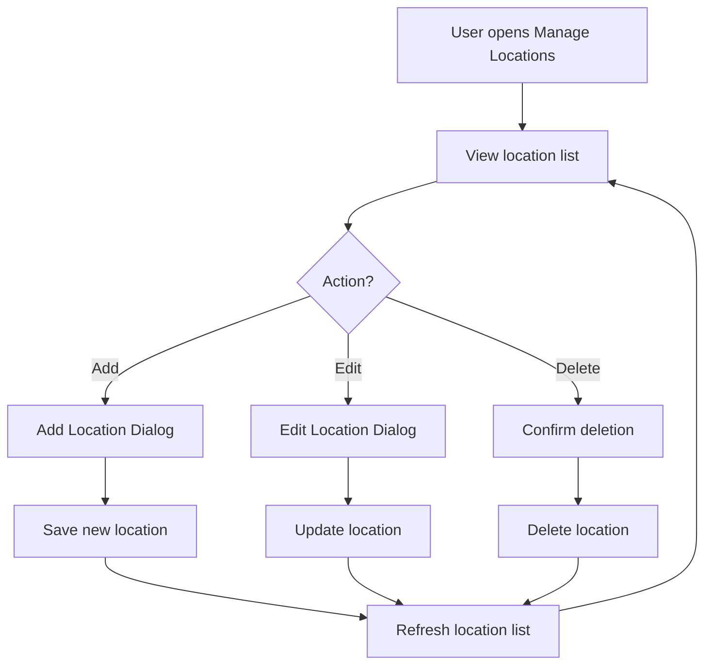
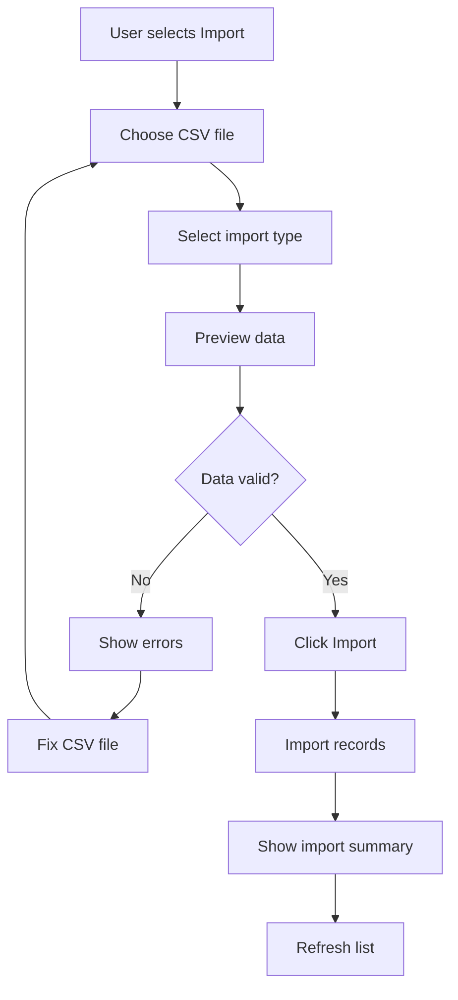
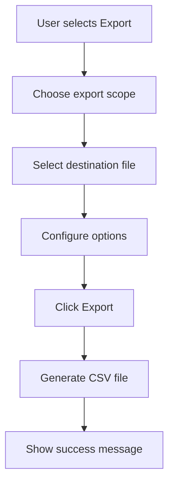
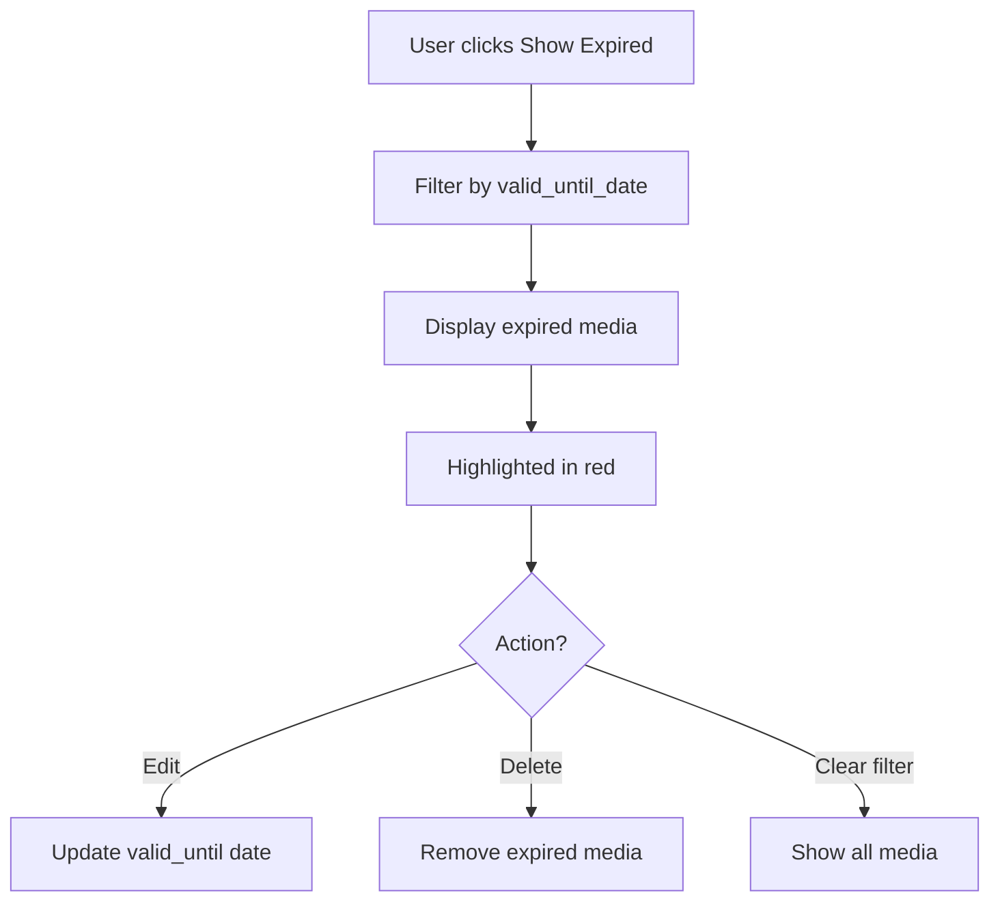

# UI Workflow

## Overview

This document describes the user interface design, screen layouts, and user workflows for the Media Archive Manager application. The UI is built with tkinter and follows a simple, intuitive design suitable for non-technical users.

## Application Architecture

### Window Structure

```
┌─────────────────────────────────────────────────────────────┐
│ Media Archive Manager                                  [_][□][X]│
├─────────────────────────────────────────────────────────────┤
│ File   Edit   View   Tools   Help                          │ Menu Bar
├─────────────────────────────────────────────────────────────┤
│ [+] [✎] [🗑] [🔍] [📊] [⚙]                                  │ Toolbar
├─────────────────────────────────────────────────────────────┤
│ Search Panel (collapsible)                                  │
├─────────────────────────────────────────────────────────────┤
│                                                             │
│                   Media List (Table)                        │
│                                                             │
│                                                             │
├─────────────────────────────────────────────────────────────┤
│ Status Bar: 42 media items | 3 expired                     │
└─────────────────────────────────────────────────────────────┘
```

## Main Window

### Components

#### 1. Menu Bar

**File Menu**
- New Media (Ctrl+N)
- Import from CSV...
- Export to CSV...
- Backup Database...
- ---
- Exit (Alt+F4)

**Edit Menu**
- Edit Selected (Ctrl+E)
- Delete Selected (Delete)
- ---
- Manage Locations... (Ctrl+L)

**View Menu**
- Show Search Panel (Ctrl+F)
- Refresh (F5)
- ---
- Filter by Type >
  - All Types
  - M-Disk
  - DVD
  - CD
  - Blu-ray
  - USB Drive
  - External HDD
  - Backup Tape
  - Other

**Tools Menu**
- Show Expired Media
- Show All Media
- ---
- Database Statistics

**Help Menu**
- User Guide
- About

#### 2. Toolbar

Quick access buttons:
- **[+]** Add New Media
- **[✎]** Edit Selected
- **[🗑]** Delete Selected
- **[🔍]** Toggle Search Panel
- **[📊]** Show Statistics
- **[⚙]** Manage Locations

#### 3. Search Panel (Collapsible)

```
┌─────────────────────────────────────────────────────────────┐
│ Search:  [_________________________]  [Search] [Clear]      │
│                                                             │
│ Search in: ○ Name  ○ Content  ○ Both                       │
│                                                             │
│ Media Type: [All Types ▼]                                  │
│                                                             │
│ Creation Date: [From: ____] [To: ____]                     │
│                                                             │
│ Location: [All Locations ▼]                                │
│                                                             │
│ ☐ Show only expired media                                  │
└─────────────────────────────────────────────────────────────┘
```

#### 4. Media List (Table)

Columns:
- **Name** (sortable, 200px)
- **Type** (sortable, 100px)
- **Company** (sortable, 120px)
- **Creation Date** (sortable, 100px)
- **Valid Until** (sortable, 100px, highlight if expired)
- **Location** (sortable, 150px, shows "box - place")
- **Content** (200px, truncated with tooltip)

Features:
- Double-click row to edit
- Right-click context menu (Edit, Delete, View Details)
- Multi-column sorting
- Row highlighting for expired media (light red background)
- Alternating row colors for readability

#### 5. Status Bar

Displays:
- Total media count
- Filtered count (if filter active)
- Expired media count
- Selected row info

## Dialogs and Windows

### 1. Add/Edit Media Dialog

```
┌─────────────────────────────────────────────────────────────┐
│ Add New Media / Edit Media                            [X]   │
├─────────────────────────────────────────────────────────────┤
│                                                             │
│  Name: *                                                    │
│  [_________________________________________________]        │
│                                                             │
│  Media Type: *                                              │
│  [M-Disk ▼]                                                 │
│                                                             │
│  Company:                                                   │
│  [_________________________________________________]        │
│                                                             │
│  License/Code:                                              │
│  [_________________________________________________]        │
│                                                             │
│  Creation Date:                                             │
│  [____-__-__] [📅]                                          │
│                                                             │
│  Valid Until:                                               │
│  [____-__-__] [📅]                                          │
│                                                             │
│  Storage Location:                                          │
│  [Select Location ▼]                    [Manage Locations] │
│                                                             │
│  Content Description:                                       │
│  ┌───────────────────────────────────────────────────────┐ │
│  │                                                       │ │
│  │                                                       │ │
│  └───────────────────────────────────────────────────────┘ │
│                                                             │
│  Remarks:                                                   │
│  ┌───────────────────────────────────────────────────────┐ │
│  │                                                       │ │
│  │                                                       │ │
│  └───────────────────────────────────────────────────────┘ │
│                                                             │
│  * Required fields                                          │
│                                                             │
│              [Save]  [Save & New]  [Cancel]                │
└─────────────────────────────────────────────────────────────┘
```

**Validation:**
- Name: Required, max 200 chars
- Media Type: Required, dropdown selection
- Creation Date: Optional, valid date, not in future
- Valid Until: Optional, must be >= creation date
- All text fields: Trim whitespace

**Behavior:**
- **Save**: Save and close dialog
- **Save & New**: Save and clear form for next entry
- **Cancel**: Close without saving (confirm if changes made)
- Date picker buttons open calendar widget
- "Manage Locations" opens location management dialog

### 2. Manage Storage Locations Dialog

```
┌─────────────────────────────────────────────────────────────┐
│ Manage Storage Locations                              [X]   │
├─────────────────────────────────────────────────────────────┤
│                                                             │
│  ┌─────────────────────────────────────────────────────┐   │
│  │ Box              │ Place           │ Detail         │   │
│  ├─────────────────────────────────────────────────────┤   │
│  │ CD Register A    │ office cabinet  │ slot 4         │   │
│  │ DVD Box 1        │ basement shelf  │ top row        │   │
│  │ M-Disk Archive   │ fireproof safe  │                │   │
│  │                  │                 │                │   │
│  └─────────────────────────────────────────────────────┘   │
│                                                             │
│  [Add New]  [Edit Selected]  [Delete Selected]             │
│                                                             │
│  ⚠ Deleting a location will not delete media, but will     │
│     remove the location reference from affected media.      │
│                                                             │
│                                      [Close]                │
└─────────────────────────────────────────────────────────────┘
```

**Features:**
- List all storage locations
- Add new location (opens form)
- Edit selected location (opens form)
- Delete location (with confirmation)
- Show media count per location

### 3. Add/Edit Location Dialog

```
┌─────────────────────────────────────────────────────────────┐
│ Add New Location / Edit Location                      [X]   │
├─────────────────────────────────────────────────────────────┤
│                                                             │
│  Box: *                                                     │
│  [_________________________________________________]        │
│  Example: CD Register A, DVD Box 1                          │
│                                                             │
│  Place: *                                                   │
│  [_________________________________________________]        │
│  Example: office cabinet, basement shelf                    │
│                                                             │
│  Detail:                                                    │
│  [_________________________________________________]        │
│  Example: slot 4, top row                                   │
│                                                             │
│  * Required fields                                          │
│                                                             │
│                            [Save]  [Cancel]                 │
└─────────────────────────────────────────────────────────────┘
```

### 4. Delete Confirmation Dialog

```
┌─────────────────────────────────────────────────────────────┐
│ Confirm Delete                                        [X]   │
├─────────────────────────────────────────────────────────────┤
│                                                             │
│  ⚠ Are you sure you want to delete this media?             │
│                                                             │
│  Name: Windows 11 Pro                                       │
│  Type: DVD                                                  │
│                                                             │
│  This action cannot be undone.                              │
│                                                             │
│                            [Delete]  [Cancel]               │
└─────────────────────────────────────────────────────────────┘
```

### 5. Import CSV Dialog

```
┌─────────────────────────────────────────────────────────────┐
│ Import from CSV                                       [X]   │
├─────────────────────────────────────────────────────────────┤
│                                                             │
│  Select CSV file to import:                                 │
│  [_________________________________________] [Browse...]    │
│                                                             │
│  Import type:                                               │
│  ○ Media records                                            │
│  ○ Storage locations                                        │
│                                                             │
│  Options:                                                   │
│  ☑ Skip first row (header)                                 │
│  ☑ Validate data before import                             │
│  ☐ Update existing records (match by name)                 │
│                                                             │
│  Preview:                                                   │
│  ┌───────────────────────────────────────────────────────┐ │
│  │ First 5 rows will be shown here...                   │ │
│  └───────────────────────────────────────────────────────┘ │
│                                                             │
│                            [Import]  [Cancel]               │
└─────────────────────────────────────────────────────────────┘
```

### 6. Export CSV Dialog

```
┌─────────────────────────────────────────────────────────────┐
│ Export to CSV                                         [X]   │
├─────────────────────────────────────────────────────────────┤
│                                                             │
│  Export what:                                               │
│  ○ All media records                                        │
│  ○ Filtered media (current view)                           │
│  ○ Selected media only                                      │
│  ○ Storage locations                                        │
│                                                             │
│  Save to:                                                   │
│  [_________________________________________] [Browse...]    │
│                                                             │
│  Options:                                                   │
│  ☑ Include header row                                      │
│  ☑ Include location details                                │
│                                                             │
│                            [Export]  [Cancel]               │
└─────────────────────────────────────────────────────────────┘
```

### 7. Database Statistics Dialog

```
┌─────────────────────────────────────────────────────────────┐
│ Database Statistics                                   [X]   │
├─────────────────────────────────────────────────────────────┤
│                                                             │
│  Total Media: 42                                            │
│  Total Locations: 5                                         │
│  Expired Media: 3                                           │
│                                                             │
│  Media by Type:                                             │
│  ┌───────────────────────────────────────────────────────┐ │
│  │ M-Disk:        15                                     │ │
│  │ DVD:           18                                     │ │
│  │ CD:             6                                     │ │
│  │ Blu-ray:        2                                     │ │
│  │ USB Drive:      1                                     │ │
│  └───────────────────────────────────────────────────────┘ │
│                                                             │
│  Media by Location:                                         │
│  ┌───────────────────────────────────────────────────────┐ │
│  │ CD Register A - office cabinet:     12               │ │
│  │ DVD Box 1 - basement shelf:         18               │ │
│  │ M-Disk Archive - fireproof safe:    10               │ │
│  │ No location assigned:                2               │ │
│  └───────────────────────────────────────────────────────┘ │
│                                                             │
│                                      [Close]                │
└─────────────────────────────────────────────────────────────┘
```

## User Workflows

### Workflow 1: Add New Media



**Steps:**
1. Click "Add New" button (toolbar or menu)
2. Fill in media details (name and type required)
3. Select or create storage location
4. Add content description and remarks
5. Click "Save" or "Save & New"
6. Media appears in list

### Workflow 2: Search for Media



**Steps:**
1. Click "Search" button or press Ctrl+F
2. Enter search term
3. Select search scope (name, content, or both)
4. Optionally add filters (type, date, location)
5. Click "Search"
6. View filtered results
7. Click "Clear" to reset

### Workflow 3: Edit Existing Media



**Steps:**
1. Find media in list (search or scroll)
2. Double-click row or click "Edit" button
3. Modify fields as needed
4. Click "Save"
5. Changes reflected in list

### Workflow 4: Delete Media



**Steps:**
1. Select media in list
2. Click "Delete" button or press Delete key
3. Confirm deletion
4. Media removed from list

### Workflow 5: Manage Storage Locations



**Steps:**
1. Click "Manage Locations" (menu or toolbar)
2. View all locations with media counts
3. Add, edit, or delete locations
4. Close dialog
5. Updated locations available in media form

### Workflow 6: Import from CSV



**Steps:**
1. File → Import from CSV
2. Browse and select CSV file
3. Choose import type (media or locations)
4. Review preview
5. Click "Import"
6. View import summary (success/errors)

### Workflow 7: Export to CSV



**Steps:**
1. File → Export to CSV
2. Choose what to export (all, filtered, selected)
3. Choose save location
4. Configure options (headers, location details)
5. Click "Export"
6. CSV file created

### Workflow 8: View Expired Media



**Steps:**
1. Tools → Show Expired Media
2. View list of expired items (highlighted)
3. Edit or delete as needed
4. Click "Show All Media" to clear filter

## UI Design Guidelines

### Colors

- **Primary**: #2196F3 (blue)
- **Success**: #4CAF50 (green)
- **Warning**: #FF9800 (orange)
- **Error**: #F44336 (red)
- **Background**: #FFFFFF (white)
- **Alternate Row**: #F5F5F5 (light gray)
- **Expired Row**: #FFEBEE (light red)

### Fonts

- **Default**: System default (Segoe UI on Windows)
- **Size**: 9pt for normal text, 10pt for headers
- **Monospace**: Consolas for license codes

### Spacing

- **Padding**: 10px around dialogs
- **Margin**: 5px between form fields
- **Button spacing**: 5px between buttons

### Icons

Use Unicode symbols for toolbar buttons:
- Add: ➕ or [+]
- Edit: ✏️ or [✎]
- Delete: 🗑️ or [🗑]
- Search: 🔍 or [🔍]
- Settings: ⚙️ or [⚙]

### Accessibility

- Tab order follows logical flow
- All buttons accessible via keyboard
- Tooltips on toolbar buttons
- Clear focus indicators
- Adequate color contrast

## Error Handling

### Validation Errors

Display inline near the field with red text:
```
Name: *
[_________________________________________________]
⚠ Name is required
```

### Database Errors

Show message box with clear explanation:
```
┌─────────────────────────────────────────────────────────────┐
│ Database Error                                        [X]   │
├─────────────────────────────────────────────────────────────┤
│                                                             │
│  ⚠ Unable to save media record.                            │
│                                                             │
│  Error: Database is locked by another process.             │
│                                                             │
│  Please try again in a moment.                              │
│                                                             │
│                                      [OK]                   │
└─────────────────────────────────────────────────────────────┘
```

### Import Errors

Show detailed error report:
```
Import completed with errors:
- Row 5: Invalid date format
- Row 12: Missing required field 'name'
- Row 18: Unknown media type

Successfully imported: 15 records
Failed: 3 records
```

## Keyboard Shortcuts

| Shortcut | Action |
|----------|--------|
| Ctrl+N | Add new media |
| Ctrl+E | Edit selected media |
| Delete | Delete selected media |
| Ctrl+F | Toggle search panel |
| Ctrl+L | Manage locations |
| F5 | Refresh list |
| Ctrl+Q | Quit application |
| Enter | Open edit dialog (when row selected) |
| Escape | Close dialog/clear search |

## References

- [PROJECT_OVERVIEW.md](PROJECT_OVERVIEW.md) - Application overview
- [DATA_MODEL.md](DATA_MODEL.md) - Database schema
- [DEV_RULES.md](DEV_RULES.md) - Implementation guidelines
- [TASKS.md](TASKS.md) - Implementation roadmap
