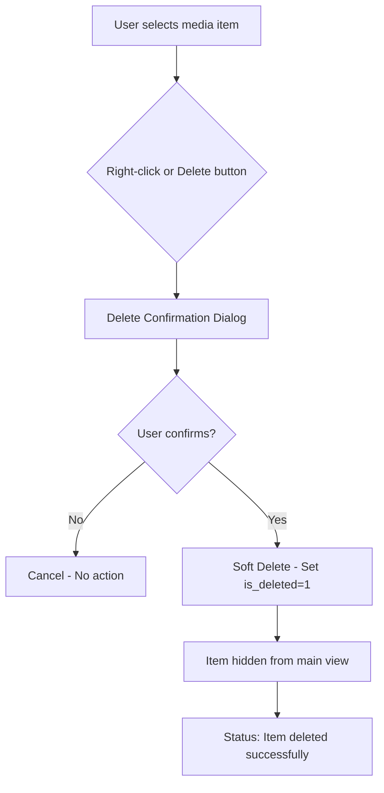
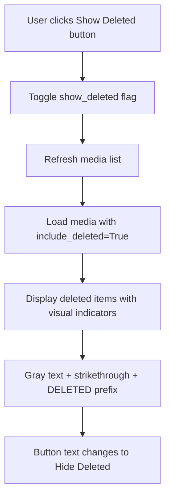
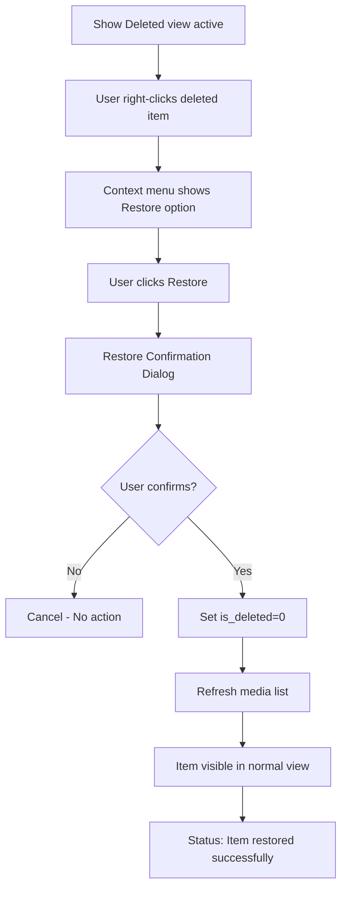
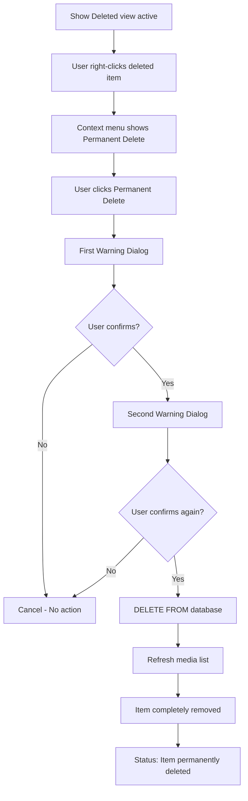
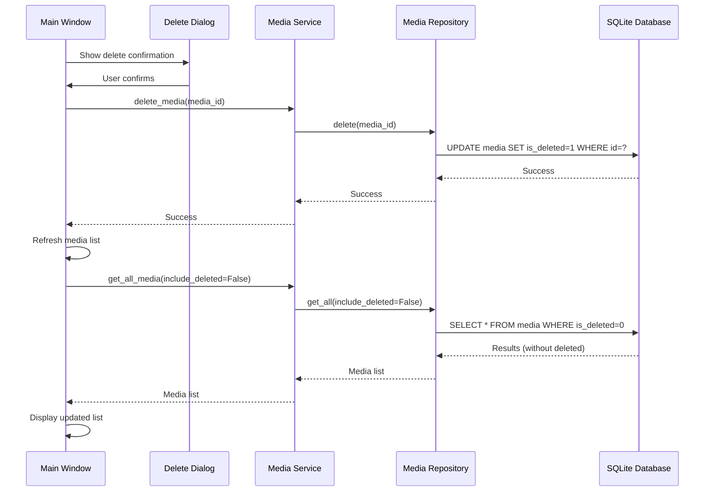
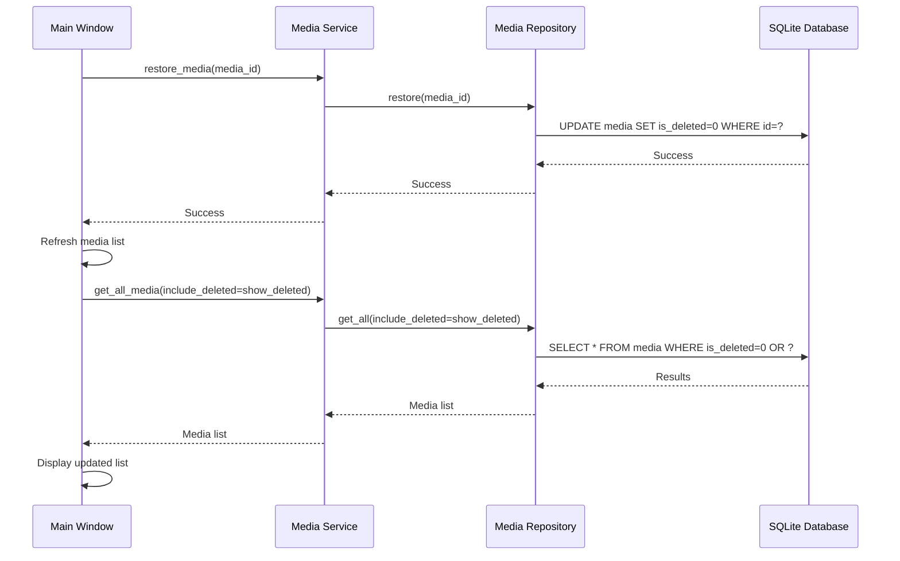
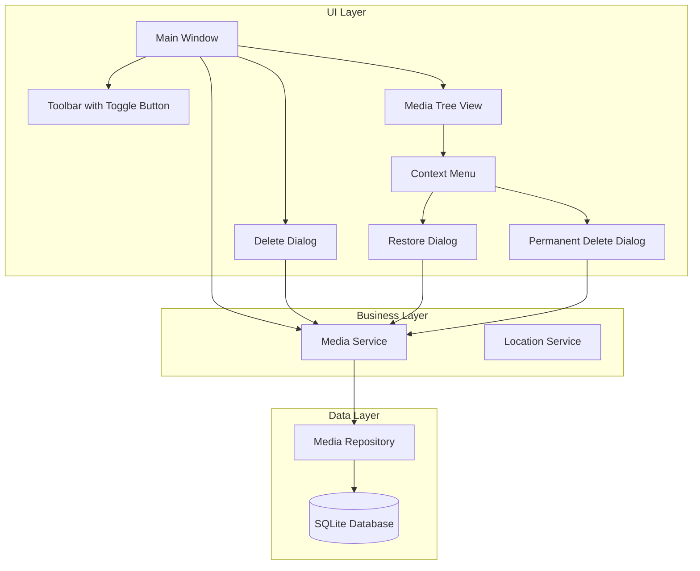
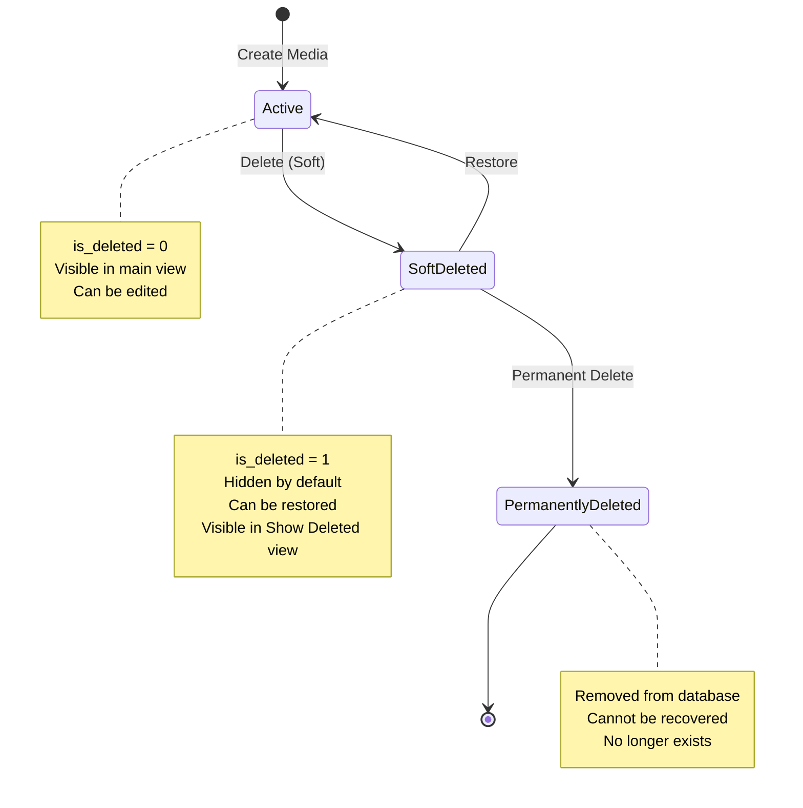

# Phase 9B: Soft Delete Workflow Diagrams

## User Workflow: Deleting Media



## User Workflow: Viewing Deleted Items



## User Workflow: Restoring Deleted Item



## User Workflow: Permanent Delete



## Data Flow: Soft Delete Operation



## Data Flow: Restore Operation



## Component Architecture



## State Diagram: Media Item States



## UI Component Layout

```
┌─────────────────────────────────────────────────────────────────┐
│ Media Archive Manager                                        [_][□][X]│
├─────────────────────────────────────────────────────────────────┤
│ File  Edit  View  Tools  Filter  Help                          │
├─────────────────────────────────────────────────────────────────┤
│ [Add Media] [Edit Media] [Delete Media] │ [Locations] [Expired] │ [Show Deleted] │
└─────────────────────────────────────────────────────────────────┘
│                                                                 │
│ ┌─ Media Tab ─────────────────────────────────────────────────┐│
│ │ Number │ Name                │ Type    │ Category │ Box │...││
│ │────────┼─────────────────────┼─────────┼──────────┼─────┼───││
│ │ 1      │ My CD               │ CD-ROM  │ Archive  │ 1   │...││
│ │ 2      │ [DELETED] Old DVD   │ DVD     │ Backup   │ 2   │...││ ← Gray + strikethrough
│ │ 3      │ Important Data      │ CD-ROM  │ Program  │ 1   │...││
│ └─────────────────────────────────────────────────────────────┘│
│                                                                 │
│ Status: Loaded 3 media items (1 deleted)                       │
└─────────────────────────────────────────────────────────────────┘

Context Menu (Normal Item):
┌──────────────────┐
│ Edit             │
│ Delete           │
│──────────────────│
│ View Location    │
└──────────────────┘

Context Menu (Deleted Item):
┌──────────────────┐
│ Restore          │
│──────────────────│
│ Permanent Delete │
└──────────────────┘
```

## Implementation Checklist

### Phase 1: Basic Soft Delete UI
- [ ] Add `show_deleted` instance variable to MainWindow
- [ ] Add "Show Deleted" toggle button to toolbar
- [ ] Implement `_toggle_deleted()` method
- [ ] Update `_refresh_media_list()` to use `include_deleted` parameter
- [ ] Add visual indicators (tags) for deleted items
- [ ] Test basic show/hide functionality

### Phase 2: Context Menu and Restore
- [ ] Add right-click event handler to media tree
- [ ] Implement `_on_media_right_click()` method
- [ ] Create context menu with conditional options
- [ ] Implement `_restore_media()` method
- [ ] Add restore confirmation dialog
- [ ] Test restore functionality

### Phase 3: Permanent Delete
- [ ] Implement `_permanent_delete_media()` method
- [ ] Add double confirmation dialogs
- [ ] Add strong warning messages
- [ ] Test permanent delete functionality
- [ ] Verify item completely removed

### Phase 4: Statistics and Search
- [ ] Update `get_media_statistics()` to exclude deleted
- [ ] Add deleted count to statistics
- [ ] Update statistics dialog to show deleted count
- [ ] Update `_perform_search()` to exclude deleted
- [ ] Test statistics accuracy
- [ ] Test search filtering

### Phase 5: Dialog Updates
- [ ] Update DeleteConfirmDialog with soft delete info
- [ ] Add informational message about restore
- [ ] Test dialog appearance and behavior

### Phase 6: Testing
- [ ] Create test file `test_phase9b_soft_delete.py`
- [ ] Write unit tests for all operations
- [ ] Write integration tests
- [ ] Run manual testing checklist
- [ ] Fix any bugs found

### Phase 7: Documentation
- [ ] Create user documentation
- [ ] Update technical documentation
- [ ] Add code comments
- [ ] Update CHANGELOG

## Key Design Decisions

### 1. Visual Indicators
**Decision**: Use gray text + strikethrough + "[DELETED]" prefix  
**Rationale**: Multiple visual cues ensure deleted items are clearly distinguished

### 2. Toggle Button Location
**Decision**: Place in toolbar after "Expired" button  
**Rationale**: Logical grouping with other view filters

### 3. Permanent Delete Confirmation
**Decision**: Require double confirmation with strong warnings  
**Rationale**: Prevent accidental permanent data loss

### 4. Default Behavior
**Decision**: Hide deleted items by default  
**Rationale**: Keeps UI clean and focused on active items

### 5. Statistics Handling
**Decision**: Exclude deleted items from statistics by default  
**Rationale**: Statistics should reflect active collection

### 6. Context Menu
**Decision**: Different options for normal vs deleted items  
**Rationale**: Provides appropriate actions based on item state

## Testing Scenarios

### Scenario 1: Basic Soft Delete
1. Select active media item
2. Click Delete button
3. Confirm deletion
4. Verify item disappears from list
5. Click "Show Deleted"
6. Verify item appears with visual indicators

### Scenario 2: Restore Deleted Item
1. Enable "Show Deleted" view
2. Right-click deleted item
3. Select "Restore"
4. Confirm restoration
5. Verify item appears in normal view
6. Verify visual indicators removed

### Scenario 3: Permanent Delete
1. Enable "Show Deleted" view
2. Right-click deleted item
3. Select "Permanent Delete"
4. Confirm first warning
5. Confirm second warning
6. Verify item completely removed
7. Verify not visible even with "Show Deleted"

### Scenario 4: Statistics Accuracy
1. Create 5 media items
2. Delete 2 items
3. View statistics
4. Verify total shows 3 (not 5)
5. Verify deleted count shows 2

### Scenario 5: Search Filtering
1. Create media items with searchable names
2. Delete some items
3. Perform search
4. Verify deleted items not in results
5. Enable "Show Deleted"
6. Perform same search
7. Verify deleted items now included

## Performance Considerations

### Database Queries
- Index on `is_deleted` column improves WHERE clause performance
- Typical query: `SELECT * FROM media WHERE is_deleted = 0`
- Index scan instead of full table scan

### UI Rendering
- Tags for visual indicators are efficient in Tkinter
- No performance impact from strikethrough/color changes
- Lazy loading: deleted items only loaded when requested

### Memory Usage
- Minimal increase (one boolean per media item)
- Deleted items not loaded unless explicitly requested
- No significant memory overhead

## Security and Audit

### Logging
All delete operations should be logged:
- Soft delete: `logger.info(f"Soft deleted media: {media_id}")`
- Restore: `logger.info(f"Restored media: {media_id}")`
- Permanent delete: `logger.info(f"Permanently deleted media: {media_id}")`

### Future Enhancements
- Add user tracking (who deleted/restored)
- Add timestamp tracking (when deleted/restored)
- Add audit trail table
- Add permission levels for permanent delete

---

**Document Version**: 1.0  
**Created**: 2026-03-09  
**Purpose**: Visual guide for Phase 9B implementation
