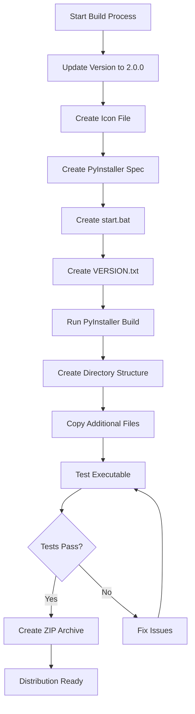

# Portable Distribution Plan for Media Archive Manager

## Overview

Create a portable, standalone distribution of the Media Archive Manager application that runs on Windows without requiring Python installation. The distribution will be packaged as a single folder containing everything needed to run the application.

## Requirements

### Core Requirements
- Application must run without installing Python
- All required files must be included in a single folder
- The folder must contain everything needed to run the application
- Database file must NOT be overwritten during updates
- Version must be set to V2.0.0

### Deliverables
1. Compiled executable: `MediaArchiveManager.exe`
2. Start script: `start.bat`
3. Required folders: `data/`, `backups/`, `config/`
4. Version file: `VERSION.txt`
5. Application icon displayed in executable

### Target Structure
```
dist/
   MediaArchiveManager/
      MediaArchiveManager.exe
      start.bat
      VERSION.txt
      icon.ico
      data/
         .gitkeep
      backups/
         .gitkeep
      config/
         .gitkeep
      logs/
         .gitkeep
```

## Implementation Plan

### Phase 1: Version Update (V2.0.0)

**Files to Update:**
1. [`src/utils/config.py`](src/utils/config.py:97)
   - Change `APP_VERSION = "1.0.0"` to `APP_VERSION = "2.0.0"`

2. [`src/gui/main_window.py`](src/gui/main_window.py:90)
   - Already uses `APP_VERSION` from config - no change needed

3. [`src/gui/about_dialog.py`](src/gui/about_dialog.py:80)
   - Already uses `APP_VERSION` from config - no change needed

### Phase 2: Application Icon

**Create Icon File:**
- File: `icon.ico`
- Location: Project root
- Format: Windows ICO format (16x16, 32x32, 48x48, 256x256 sizes)
- Design: Simple media/archive themed icon

**Icon Creation Options:**
1. Use online icon generator (e.g., favicon.io, icon-icons.com)
2. Create using GIMP or similar tool
3. Use a placeholder icon for now

### Phase 3: PyInstaller Configuration

**Create PyInstaller Spec File:**
- File: `MediaArchiveManager.spec`
- Purpose: Configure PyInstaller build process
- Key configurations:
  - Single file: No (use folder mode for better performance)
  - Console: No (windowed application)
  - Icon: `icon.ico`
  - Name: `MediaArchiveManager`
  - Include data files: None (all data is generated at runtime)
  - Hidden imports: None needed (standard library only)

**Spec File Structure:**
```python
# -*- mode: python ; coding: utf-8 -*-

block_cipher = None

a = Analysis(
    ['main.py'],
    pathex=[],
    binaries=[],
    datas=[],
    hiddenimports=[],
    hookspath=[],
    hooksconfig={},
    runtime_hooks=[],
    excludes=[],
    win_no_prefer_redirects=False,
    win_private_assemblies=False,
    cipher=block_cipher,
    noarchive=False,
)

pyz = PYZ(a.pure, a.zipped_data, cipher=block_cipher)

exe = EXE(
    pyz,
    a.scripts,
    [],
    exclude_binaries=True,
    name='MediaArchiveManager',
    debug=False,
    bootloader_ignore_signals=False,
    strip=False,
    upx=True,
    console=False,
    disable_windowed_traceback=False,
    argv_emulation=False,
    target_arch=None,
    codesign_identity=None,
    entitlements_file=None,
    icon='icon.ico',
)

coll = COLLECT(
    exe,
    a.binaries,
    a.zipfiles,
    a.datas,
    strip=False,
    upx=True,
    upx_exclude=[],
    name='MediaArchiveManager',
)
```

### Phase 4: Start Script

**Create start.bat:**
- File: `start.bat`
- Purpose: Launch the application with proper error handling
- Features:
  - Check if executable exists
  - Create required directories if missing
  - Launch application
  - Handle errors gracefully

**Script Content:**
```batch
@echo off
REM Media Archive Manager - Startup Script
REM Version 2.0.0

echo Starting Media Archive Manager...

REM Create required directories if they don't exist
if not exist "data" mkdir data
if not exist "backups" mkdir backups
if not exist "config" mkdir config
if not exist "logs" mkdir logs

REM Check if executable exists
if not exist "MediaArchiveManager.exe" (
    echo ERROR: MediaArchiveManager.exe not found!
    echo Please ensure you are running this script from the correct directory.
    pause
    exit /b 1
)

REM Launch the application
start "" "MediaArchiveManager.exe"

REM Exit without waiting
exit /b 0
```

### Phase 5: Version File

**Create VERSION.txt:**
- File: `VERSION.txt`
- Purpose: Display version information for users
- Content:
```
Media Archive Manager
Version 2.0.0
Build date: 2026-03-09

This is a portable distribution.
No installation required.

To start the application:
- Double-click MediaArchiveManager.exe
- Or double-click start.bat

Important Notes:
- The database file (data/media_archive.db) contains your data
- Do NOT delete or overwrite this file during updates
- Create backups regularly using File > Backup Database

For support and documentation, see the README.md file.
```

### Phase 6: Build Automation Script

**Create build_portable.py:**
- File: `build_portable.py`
- Purpose: Automate the entire build process
- Features:
  - Clean previous builds
  - Run PyInstaller
  - Create directory structure
  - Copy additional files
  - Create VERSION.txt with current date
  - Verify build integrity

**Script Structure:**
```python
#!/usr/bin/env python3
"""
Build script for creating portable distribution of Media Archive Manager.

This script automates the entire build process:
1. Cleans previous builds
2. Runs PyInstaller
3. Creates required directory structure
4. Copies additional files
5. Generates VERSION.txt with current date
6. Verifies build integrity
"""

import os
import shutil
import subprocess
import sys
from datetime import datetime
from pathlib import Path

# Build configuration
APP_NAME = "MediaArchiveManager"
VERSION = "2.0.0"
BUILD_DATE = datetime.now().strftime("%Y-%m-%d")

def main():
    # Implementation steps...
    pass
```

### Phase 7: Directory Structure Setup

**Required Directories:**
1. `data/` - Database storage
   - Contains: `media_archive.db` (created at runtime)
   - Include: `.gitkeep` file

2. `backups/` - Database backups
   - User-created backups stored here
   - Include: `.gitkeep` file

3. `config/` - Configuration files
   - Future use for user preferences
   - Include: `.gitkeep` file

4. `logs/` - Application logs
   - Contains: `media_archive.log` (created at runtime)
   - Include: `.gitkeep` file

### Phase 8: Database Protection Strategy

**Prevent Database Overwrite:**
1. Database is created at runtime if it doesn't exist
2. Never include database in distribution
3. Document backup/restore process
4. Add warning in VERSION.txt

**Update Process:**
1. User backs up database using File > Backup Database
2. User extracts new version to different folder
3. User copies `data/media_archive.db` from old to new folder
4. User runs new version

### Phase 9: Build Process

**Prerequisites:**
```bash
pip install pyinstaller
```

**Build Commands:**
```bash
# Option 1: Using spec file
pyinstaller MediaArchiveManager.spec

# Option 2: Direct command (generates spec file)
pyinstaller --name=MediaArchiveManager ^
            --windowed ^
            --icon=icon.ico ^
            --onedir ^
            main.py
```

**Post-Build Steps:**
1. Copy `start.bat` to `dist/MediaArchiveManager/`
2. Copy `VERSION.txt` to `dist/MediaArchiveManager/`
3. Copy `icon.ico` to `dist/MediaArchiveManager/`
4. Create empty directories: `data/`, `backups/`, `config/`, `logs/`
5. Add `.gitkeep` files to empty directories
6. Test the executable

### Phase 10: Testing Checklist

**Functional Tests:**
- [ ] Application launches via `MediaArchiveManager.exe`
- [ ] Application launches via `start.bat`
- [ ] Window title shows "Media Archive Manager v2.0.0"
- [ ] About dialog shows "Version 2.0.0"
- [ ] Icon displays correctly in taskbar and window
- [ ] Database is created in `data/` folder
- [ ] Logs are created in `logs/` folder
- [ ] All features work correctly (add, edit, delete, search)
- [ ] Import/Export functionality works
- [ ] Backup functionality works

**Portability Tests:**
- [ ] Copy folder to different location - still works
- [ ] Copy folder to different computer - still works
- [ ] No Python installation required
- [ ] No admin rights required
- [ ] Database persists between runs

**Update Tests:**
- [ ] Existing database is not overwritten
- [ ] User data is preserved
- [ ] Preferences are preserved

## File Manifest

### Files to Create
1. `icon.ico` - Application icon
2. `MediaArchiveManager.spec` - PyInstaller configuration
3. `start.bat` - Startup script
4. `VERSION.txt` - Version information
5. `build_portable.py` - Build automation script
6. `data/.gitkeep` - Keep data directory in git
7. `backups/.gitkeep` - Keep backups directory in git
8. `config/.gitkeep` - Keep config directory in git
9. `logs/.gitkeep` - Keep logs directory in git

### Files to Modify
1. `src/utils/config.py` - Update version to 2.0.0
2. `.gitignore` - Add dist/ and build/ (already present)

### Documentation to Create
1. `docs/PORTABLE_DISTRIBUTION.md` - User guide for portable version
2. `docs/BUILD_INSTRUCTIONS.md` - Developer guide for building

## Distribution Package

**Final Package Structure:**
```
MediaArchiveManager_v2.0.0_Portable.zip
└── MediaArchiveManager/
    ├── MediaArchiveManager.exe
    ├── start.bat
    ├── VERSION.txt
    ├── icon.ico
    ├── _internal/           (PyInstaller dependencies)
    │   ├── python311.dll
    │   ├── _tkinter.pyd
    │   └── ... (other dependencies)
    ├── data/
    │   └── .gitkeep
    ├── backups/
    │   └── .gitkeep
    ├── config/
    │   └── .gitkeep
    └── logs/
        └── .gitkeep
```

**Package Size Estimate:**
- Executable + dependencies: ~30-50 MB
- Empty directories: negligible
- Total: ~30-50 MB

## Deployment Instructions

### For Developers (Building)
1. Install PyInstaller: `pip install pyinstaller`
2. Run build script: `python build_portable.py`
3. Test the build in `dist/MediaArchiveManager/`
4. Create ZIP archive: `MediaArchiveManager_v2.0.0_Portable.zip`
5. Distribute the ZIP file

### For Users (Installing)
1. Download `MediaArchiveManager_v2.0.0_Portable.zip`
2. Extract to desired location (e.g., `C:\Programs\MediaArchiveManager\`)
3. Double-click `start.bat` or `MediaArchiveManager.exe`
4. Application is ready to use

### For Users (Updating)
1. Backup database: File > Backup Database
2. Extract new version to different folder
3. Copy `data/media_archive.db` from old to new folder
4. Run new version
5. Verify data is intact
6. Delete old version folder

## Security Considerations

1. **Code Signing:** Consider signing the executable for Windows SmartScreen
2. **Antivirus:** PyInstaller executables may trigger false positives
3. **Permissions:** Application runs with user permissions (no admin required)
4. **Data Security:** Database is stored locally, no network access

## Performance Considerations

1. **Startup Time:** ~2-5 seconds (typical for PyInstaller apps)
2. **Memory Usage:** ~50-100 MB (typical for Tkinter apps)
3. **Disk Space:** ~30-50 MB for application + database size
4. **Database Performance:** SQLite handles thousands of records efficiently

## Troubleshooting

### Common Issues

**Issue: "Windows protected your PC" warning**
- Solution: Click "More info" > "Run anyway"
- Better: Code sign the executable

**Issue: Antivirus blocks executable**
- Solution: Add exception for MediaArchiveManager.exe
- Better: Submit to antivirus vendors for whitelisting

**Issue: Application doesn't start**
- Check: Windows Event Viewer for errors
- Check: logs/media_archive.log for error messages
- Verify: All files extracted correctly

**Issue: Database not found**
- Check: data/ directory exists
- Check: Write permissions in application folder
- Solution: Run start.bat to create directories

## Future Enhancements

1. **Auto-updater:** Check for updates and download automatically
2. **Installer:** Create proper Windows installer (NSIS, Inno Setup)
3. **Multi-platform:** Build for Linux and macOS
4. **Portable mode:** Store all data in application folder
5. **Silent mode:** Command-line interface for automation

## References

- PyInstaller Documentation: https://pyinstaller.org/
- Python Tkinter: https://docs.python.org/3/library/tkinter.html
- SQLite: https://www.sqlite.org/
- Windows Batch Scripting: https://ss64.com/nt/

## Workflow Diagram



## Build Timeline

1. **Version Update:** 5 minutes
2. **Icon Creation:** 15 minutes (or use placeholder)
3. **Spec File Creation:** 10 minutes
4. **Script Creation:** 20 minutes
5. **Build Automation:** 30 minutes
6. **Testing:** 30 minutes
7. **Documentation:** 20 minutes

**Total Estimated Time:** 2-3 hours

## Success Criteria

- [x] Application runs without Python installation
- [x] All files contained in single folder
- [x] Version displays as V2.0.0
- [x] Icon displays correctly
- [x] Database is not overwritten during updates
- [x] start.bat launches application successfully
- [x] VERSION.txt contains correct information
- [x] All required directories are created
- [x] Application is fully portable (can be moved/copied)
- [x] All features work in compiled version

## Notes

- This is a **portable distribution**, not an installer
- Users can run multiple versions side-by-side
- No registry modifications
- No system-wide installation
- Easy to uninstall (just delete folder)
- Perfect for USB drives or network shares
